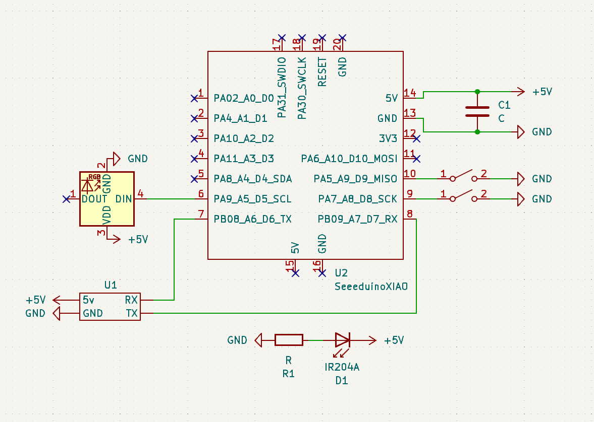
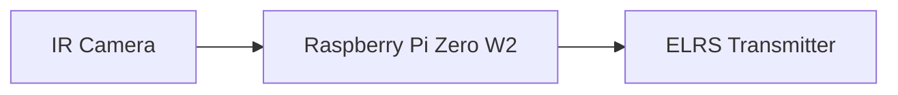
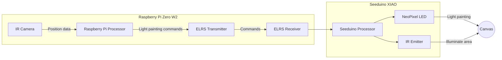
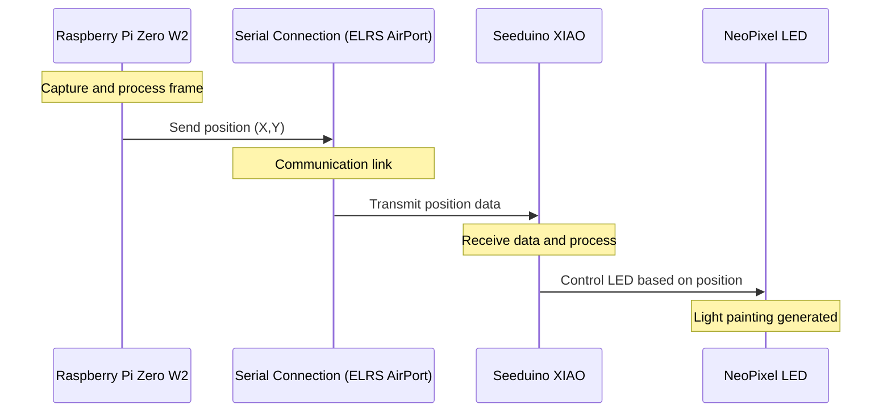
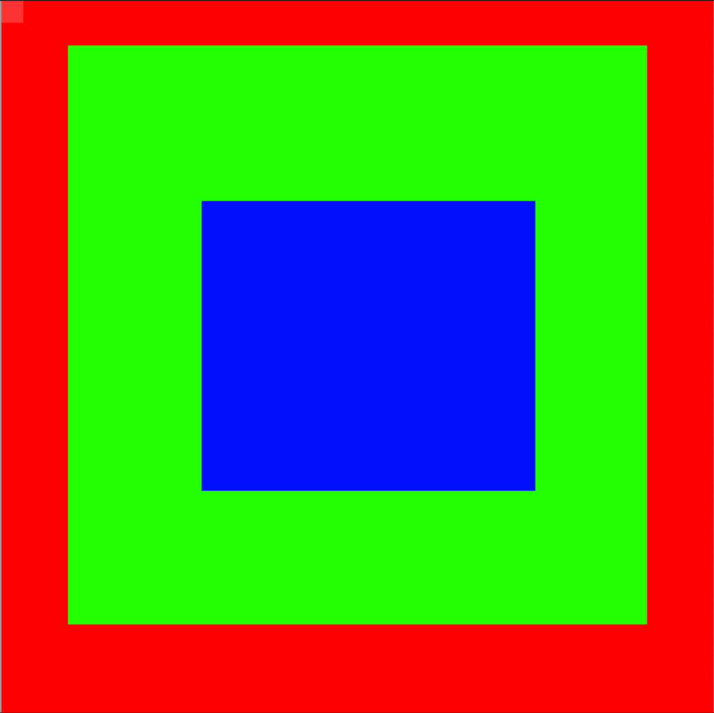
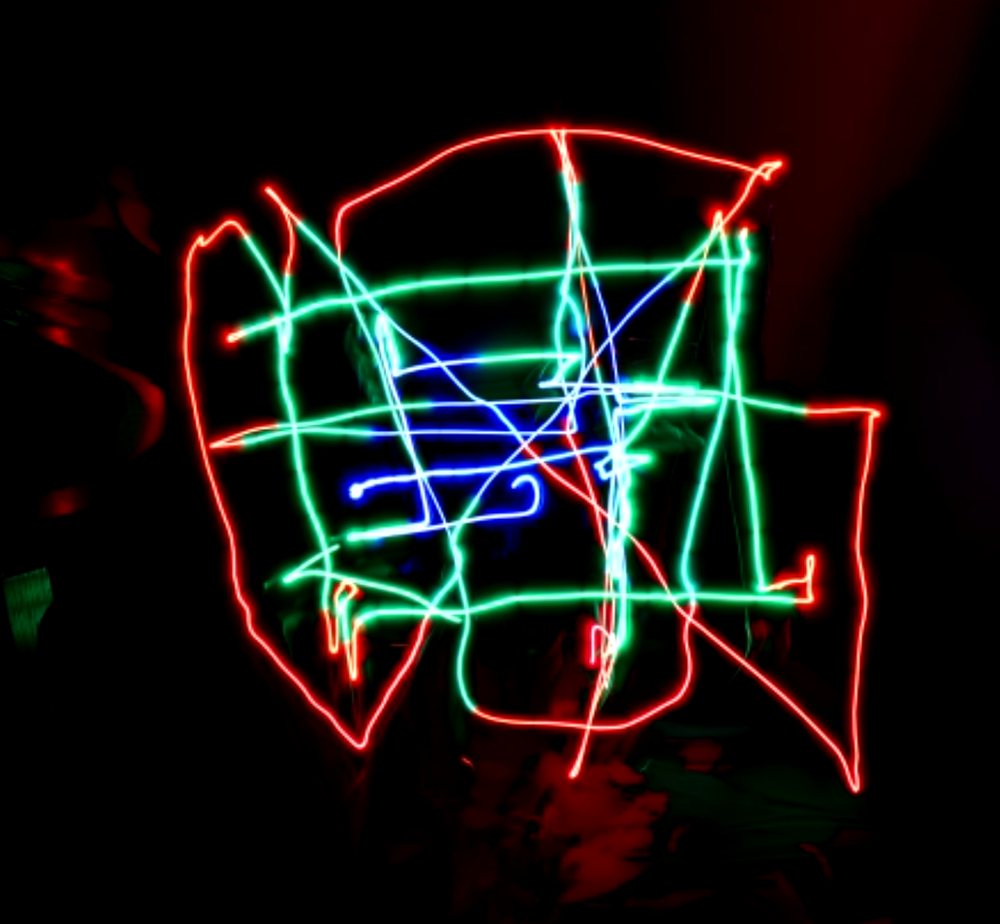

# Light Printer

This is an expansion on the idea of a light painter. The idea is to create a device that can be used to create light paintings. The device will be able to move in the x and y directions and will be able to change the color of the light. The device will be controlled by a computer and will be able to create complex light paintings.

## Components

- Raspberry Pi Zero W2
- Seeduino XIAO
- IR Camera
- IR Emitter
- NeoPixel LED
- ELRS Receiver
- ELRS Transmitter

## Hardware Setup

The hardware setup is fairly simple. The IR camera is connected to the Raspberry Pi Zero W2. The IR emitter is connected to the Seeduino XIAO. The NeoPixel LED is connected to the Seeduino XIAO. The ELRS receiver is connected to the Seeduino XIAO. The ELRS transmitter is connected to the Raspberry Pi Zero W2.

The ELRS receiver and transmitter are used to communicate between the Raspberry Pi Zero W2 and the Seeduino XIAO. The IR camera is used to detect the position of the device. The IR emitter is used to illuminate the area around the device. The NeoPixel LED is used to create the light painting.

## Wiring

### Seeduino XIAO

The schematic for the hardware setup is as follows:



### Raspberry Pi Zero W2

The schematic for the hardware setup is as follows:



## Software Setup

### Control Flow Diagram



### Sequence Diagram



### ELRS Airport

> https://www.expresslrs.org/software/airport/

The ELRS airport is used to communicate between the Raspberry Pi Zero W2 and the Seeduino XIAO. The ELRS airport is a simple serial connection that is used to send and receive data between the two devices.

ELRS airport is using 2.4 GHz frequency to communicate between the devices. And can also be used for long-range communication.

ELRS airport also has a much higher data rate than other communication protocols with a baud rate of `460800`, it can send and receive data at a much faster rate. This is important for the light painting device as it needs to send and receive data quickly.

### Raspberry Pi Zero W2

The Raspberry Pi Zero W2 is responsible for capturing the image and processing it. The image is processed to determine the position of the device. The position is then sent to the Seeduino XIAO using the ELRS transmitter.

The script running on the PI is a heavily modified version of the [Ball Tracking with OpenCV](https://pyimagesearch.com/2015/09/14/ball-tracking-with-opencv/) tutorial by Adrian Rosebrock. The script captures the image and processes it to determine the position of the device.

#### Main Imports

```python
import cv2
import imutils
import serail
from picamera2 import Picamera2
```

`cv2` is the main workhorse for image processing. `imutils` is used to resize the image. `picamera2` is used to capture the image using the NoIR camera. Then, the position data is sent to the Seeduino XIAO using the `serial` library over ELRS airport.

### Seeduino XIAO
The Seeduino XIAO is responsible for controlling the NeoPixel LED. The Seeduino XIAO receives the position data from the Raspberry Pi Zero W2 using the ELRS receiver. The Seeduino XIAO then controls the NeoPixel LED based on the position data.

#### Custom `image` Holder
```h
class image
{
public:
    explicit image(uint32_t *imageArray, int width, int height);

    void getSize(int *width, int *height);
    void getPixelValue(int x, int y, int *r, int *g, int *b, int *a);

    int getWidth() { return _width; }
    int getHeight() { return _height; }

private:
    uint32_t *_imageArray;
    int _width;
    int _height;
};
```


## Demo

Inputted Image:


Outputted Light Painting:

