# Light Printer

This is an expansion on the idea of a light painter. The idea is to create a device that can be used to create light paintings. The device will be able to move in the x and y directions and will be able to change the color of the light. The device will be controlled by a computer and will be able to create complex light paintings.

- [Light Printer](#light-printer)
  - [Hardware Setup](#hardware-setup)
    - [Components](#components)
    - [Wiring](#wiring)
      - [Seeduino XIAO](#seeduino-xiao)
      - [Raspberry Pi Zero W2](#raspberry-pi-zero-w2)
    - [Photos](#photos)
  - [Software Setup](#software-setup)
    - [Control Flow Diagram](#control-flow-diagram)
    - [Sequence Diagram](#sequence-diagram)
    - [ELRS Airport](#elrs-airport)
    - [Raspberry Pi Zero W2](#raspberry-pi-zero-w2-1)
      - [Main Imports](#main-imports)
    - [Seeduino XIAO](#seeduino-xiao-1)
      - [How to load the image](#how-to-load-the-image)
      - [How to use the image](#how-to-use-the-image)
  - [Demo](#demo)
  - [Conclusion](#conclusion)

## Hardware Setup

The hardware setup is fairly simple. The IR camera is connected to the Raspberry Pi Zero W2. The IR emitter is connected to the Seeduino XIAO. The NeoPixel LED is connected to the Seeduino XIAO. The ELRS receiver is connected to the Seeduino XIAO. The ELRS transmitter is connected to the Raspberry Pi Zero W2.

The ELRS receiver and transmitter are used to communicate between the Raspberry Pi Zero W2 and the Seeduino XIAO. The IR camera is used to detect the position of the device. The IR emitter is used to illuminate the area around the device. The NeoPixel LED is used to create the light painting.

### Components

- Raspberry Pi Zero W2
- Seeduino XIAO
- IR Camera
- IR Emitter
- NeoPixel LED
- ELRS Receiver
- ELRS Transmitter

### Wiring

#### Seeduino XIAO

The schematic for the hardware setup is as follows:

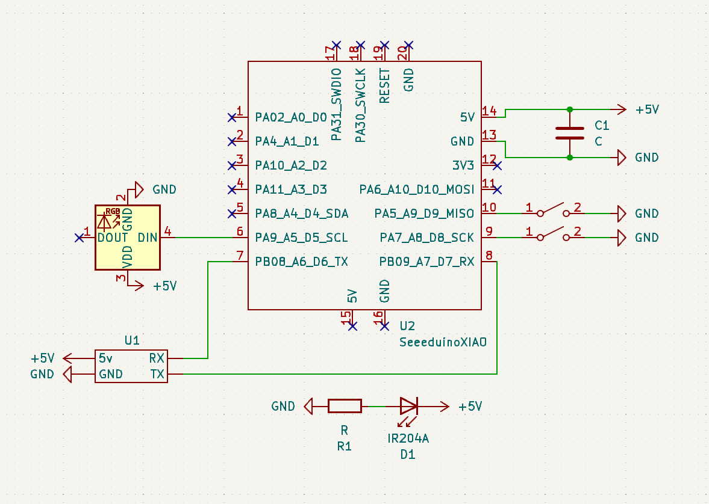

#### Raspberry Pi Zero W2

The schematic for the hardware setup is as follows:


### Photos

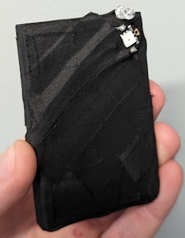
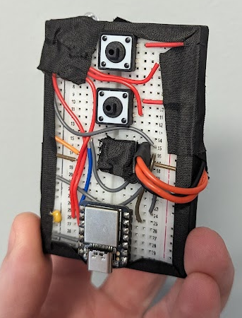

## Software Setup

### Control Flow Diagram

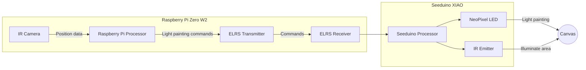

### Sequence Diagram

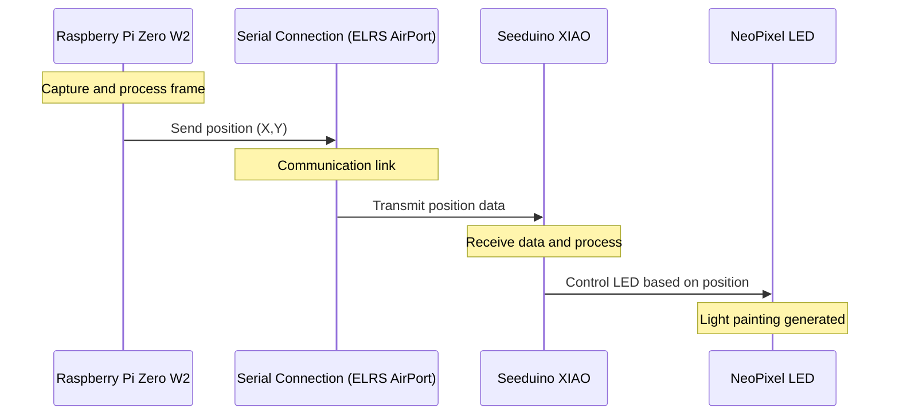

### ELRS Airport

> https://www.expresslrs.org/software/airport/

The ELRS airport is used to communicate between the Raspberry Pi Zero W2 and the Seeduino XIAO. The ELRS airport is a simple serial connection that is used to send and receive data between the two devices.

ELRS airport is using 2.4 GHz frequency to communicate between the devices. And can also be used for long-range communication.

ELRS airport also has a much higher data rate than other communication protocols with a baud rate of `460800`, it can send and receive data at a much faster rate. This is important for the light painting device as it needs to send and receive data quickly.

### Raspberry Pi Zero W2

The Raspberry Pi Zero W2 is responsible for capturing the image and processing it. The image is processed to determine the position of the device. The position is then sent to the Seeduino XIAO using the ELRS transmitter.

The script running on the PI is a heavily modified version of the [Ball Tracking with OpenCV](https://pyimagesearch.com/2015/09/14/ball-tracking-with-opencv/) tutorial by Adrian Rosebrock. The script captures the image and processes it to determine the position of the device.

#### Main Imports

```python
import cv2
import imutils
import serail
from picamera2 import Picamera2
```

`cv2` is the main workhorse for image processing. `imutils` is used to resize the image. `picamera2` is used to capture the image using the NoIR camera. Then, the position data is sent to the Seeduino XIAO using the `serial` library over ELRS airport.

### Seeduino XIAO

The Seeduino XIAO is responsible for controlling the NeoPixel LED. The Seeduino XIAO receives the position data from the Raspberry Pi Zero W2 using the ELRS receiver. The Seeduino XIAO then controls the NeoPixel LED based on the position data.

#### How to load the image

To get the image into the Seeduino XIAO, we need to convert the image into a format that can be read by the Seeduino XIAO. The image is converted into a 2D array of RGBA values. We do this using [Piskel](https://www.piskelapp.com/), a free online tool for creating pixel art.

The output is as follows:

<details>
  <summary>
    Piskle Exported Data
  </summary>

```c
#include <stdint.h>

#define NEW_PISKEL_FRAME_COUNT 1
#define NEW_PISKEL_FRAME_WIDTH 32
#define NEW_PISKEL_FRAME_HEIGHT 32

/* Piskel data for "New Piskel" */

uint32_t new_piskel_data[1][1024] = {{0xff0000ff, 0xff0000ff, 0xff0000ff, 0xff0000ff, 0xff0000ff, 0xff0000ff, 0xff0000ff, 0xff0000ff, 0xff0000ff, ..., 0xff0000ff, 0xff0000ff, 0xff0000ff, 0xff0000ff, 0xff0000ff, 0xff0000ff, 0xff0000ff, 0xff0000ff, 0xff0000ff, 0xff0000ff, 0xff0000ff, 0xff0000ff, 0xff0000ff, 0xff0000ff, 0xff0000ff, 0xff0000ff, 0xff0000ff, 0xff0000ff, 0xff0000ff, 0xff0000ff, 0xff0000ff, 0xff0000ff, 0xff0000ff, 0xff0000ff, 0xff0000ff, 0xff0000ff, 0xff0000ff, 0xff0000ff}};
```

</details>

#### How to use the image

We can use this exported file (first convert it from .c to .h) and include it in our Seeduino XIAO code.

```ino
#include "New Piskel.h"
#include "image.h"
...
image img1(new_piskel_data[0], NEW_PISKEL_FRAME_WIDTH, NEW_PISKEL_FRAME_HEIGHT);
```

We can then access all of the individual pixels using the `img1` object.

```ino
int x, y;
int r, g, b, a;

img1.getPixelValue(x, y, &r, &g, &b, &a);
```

This will give us the RGBA value of the pixel at position `x`, `y` using the following function:

```cpp
void image::getPixelValue(int x, int y, int *r, int *g, int *b, int *a)
{
    // Read the pixel at (x, y) and swap byte order from BGRA to RGBA
    uint32_t pixel = __builtin_bswap32(_imageArray[x * _width + y]);

    *r = (pixel >> 24) & 0xFF; // Extract the red component
    *g = (pixel >> 16) & 0xFF; // Extract the green component
    *b = (pixel >> 8) & 0xFF;  // Extract the blue component
    *a = pixel & 0xFF;         // Extract the alpha component
}
```

After we have the pixel data, we can then control the NeoPixel LED based on the pixel data.

## Demo

Below are some examples of the light paintings created using the light printer. The first example is a square in a square in a square. The second example is the Microsoft logo.

<details>
<summary>
    Square in a Square in a Square (Input)
</summary>

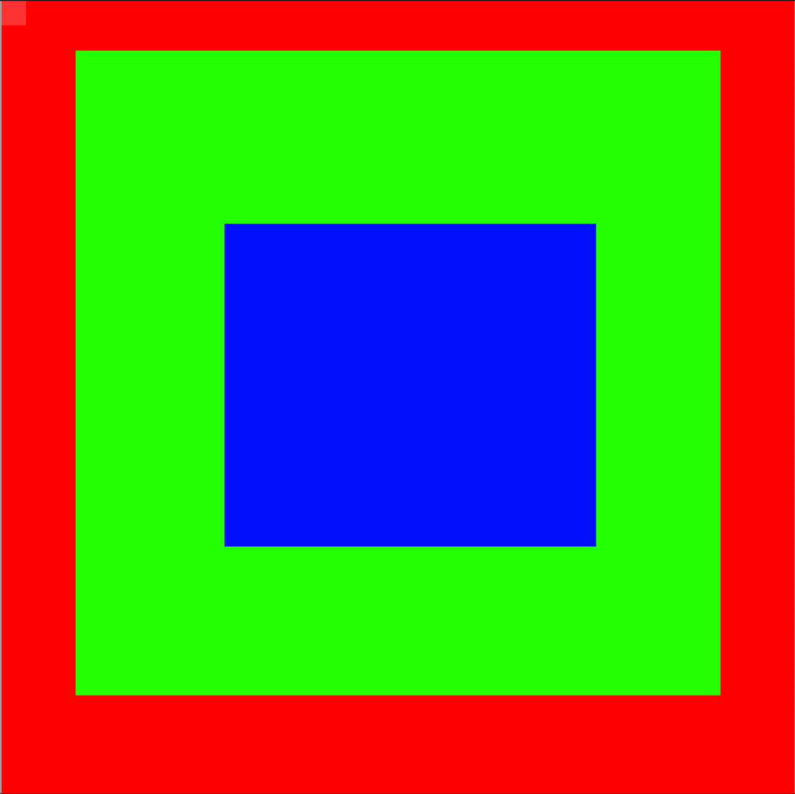

</details>

<details>
<summary>
    Square in a Square in a Square (Output)
</summary>

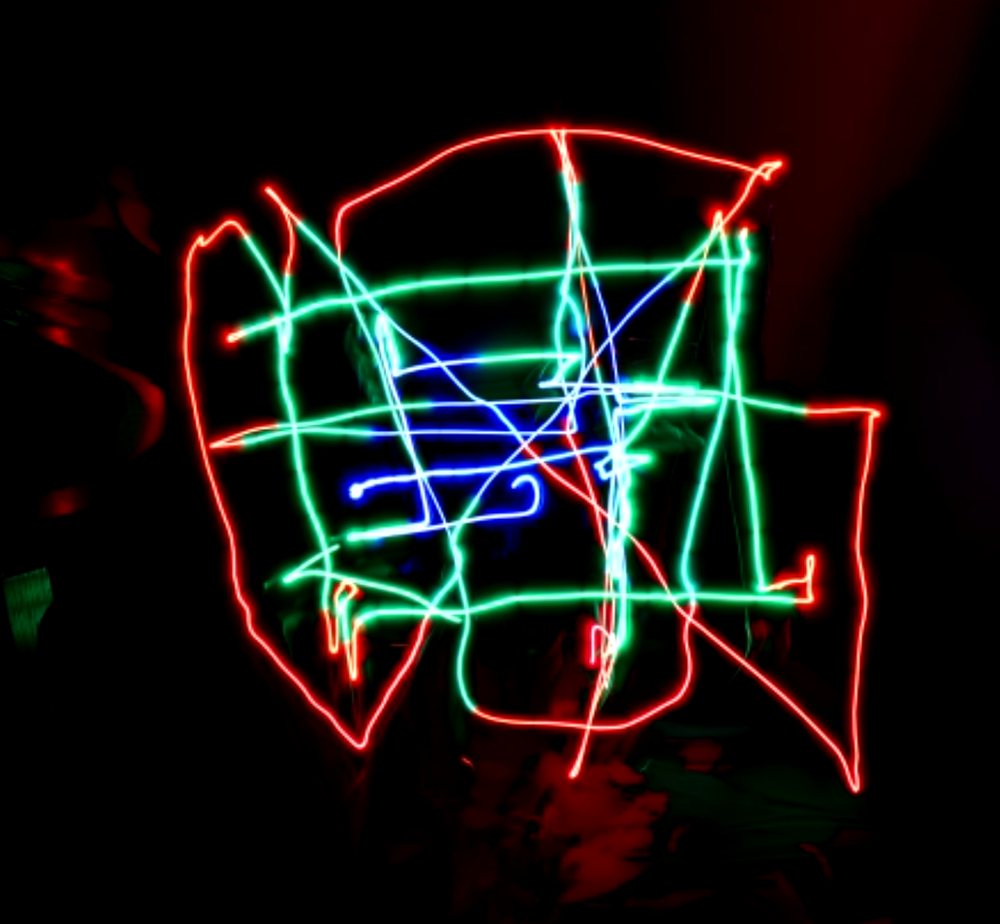

</details>

<details>
<summary>
    Square in a Square in a Square (Overlaid)
</summary>

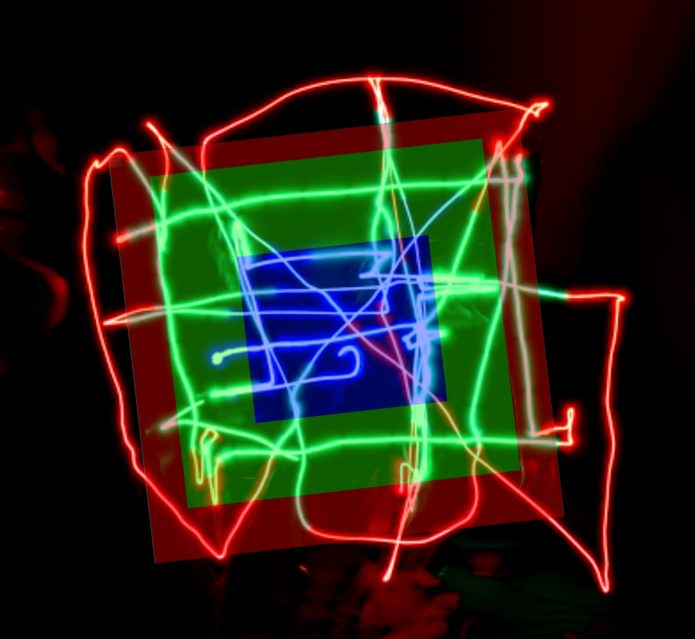

</details>

---

<details>
<summary>
    Microsoft (Input)
</summary>

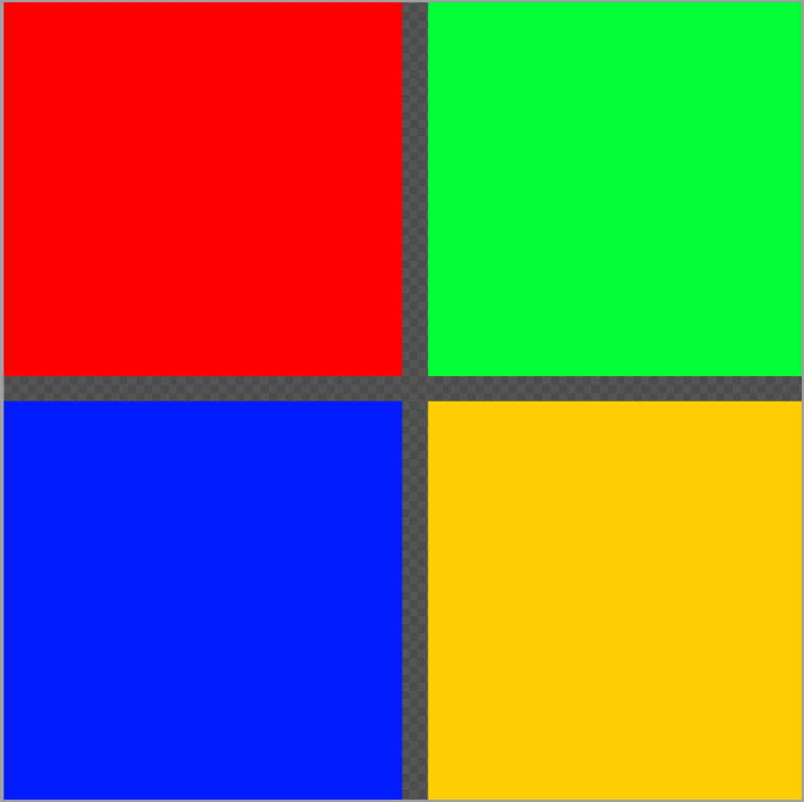

</details>

<details>
<summary>
    Microsoft (Output)
</summary>

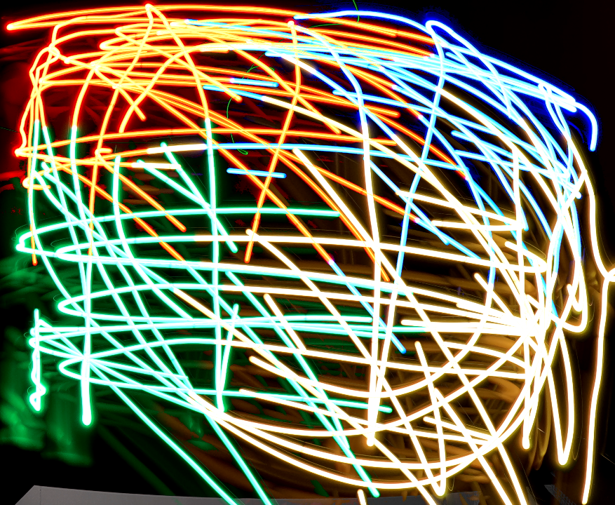

</details>

<details>
<summary>
    Microsoft (Overlaid)
</summary>

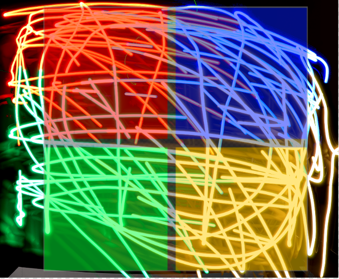

</details>

---

Sadly, this isn't the best representation of the image. But it's a start. The colors don't switch as fast as we would like and the thin light element means that a lot of lines are needed to display an image. But this is a good start to creating light paintings using the light printer.

## Conclusion

Even though the results of this first iteration are not perfect, it is a good start. The light printer is able to create light paintings using the NeoPixel LED. The light printer is able to move in the x and y directions and is able to change the color of the light. The light printer is controlled by a computer and is able to create complex light paintings.

This hits all of our initial expectations and is a good start to creating a light printer. The next steps would be to improve the speed at which the colors change and to improve the resolution of the light printer. This could be done by using a faster processor and a faster image recognition algorithm.

The other limitation is how we track the position of the device. The current implementation is not very accurate and could be improved. This might be improved with GPS or other tracking methods.
